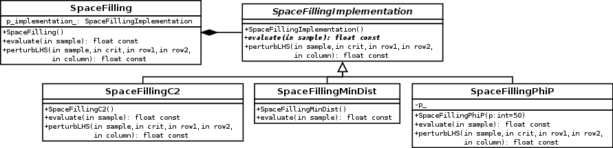

Architecture considerations
===========================

Dependencies
------------

Several dependencies are needed in order to build the module:

 - OpenTURNS
 - Sphinx-doc (optional for this doc)

Compilation
-----------

.. code-block:: bash

    cd otlhs
    mkdir -p build && cd build
    cmake \
      -DCMAKE_INSTALL_PREFIX=$PWD/install \
      -DOpenTURNS_DIR=$PWD/../../openturns/build/install/lib/cmake/openturns \
      ..

Source code structure
---------------------

SpaceFilling
^^^^^^^^^^^^

These classes implement different space filling criteria, which are consumed by
:class:`~otlhs.OptimalLHS` algorithms.

OptimalLHS
^^^^^^^^^^

This is the main class hierarchy.  The :class:`~otlhs.OptimalLHS` class is an abstract class,
inherited by :class:`~otlhs.MonteCarloLHS` and :class:`~otlhs.SimulatedAnnealingLHS`.  They implement the
generate method, which returns an :class:`~otlhs.LHSResult` instance.

LHSResult
^^^^^^^^^

As OpenTURNS already provides an :class:`~openturns.LHS` class, we had to rename it into :class:`~otlhs.LHSDesign`.
Its constructor takes as arguments variable bounds, the size of the generated sample, and an optional
boolean parameter to tell whether randomized (default) or centered LHS have to be generated.

The :class:`~otlhs.LHSResult` class is returned by OptimalLHS.generate and contains algorithm
results.  The add method is called by :class:`~otlhs.OptimalLHS` (once if there is no restart,
and one plus one by restart otherwise), and informations can then be extracted by accessors.
If no restart argument is specified, informations about global optimum are retrieved.  If a
restart number is provided, informations about this specific run are retrieved.

