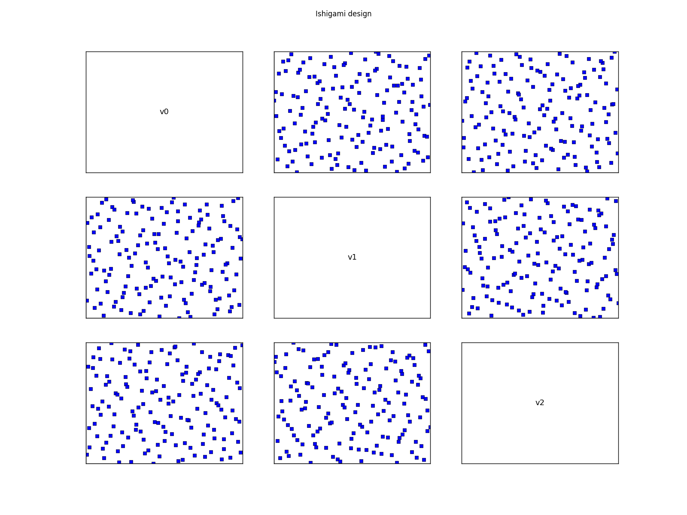
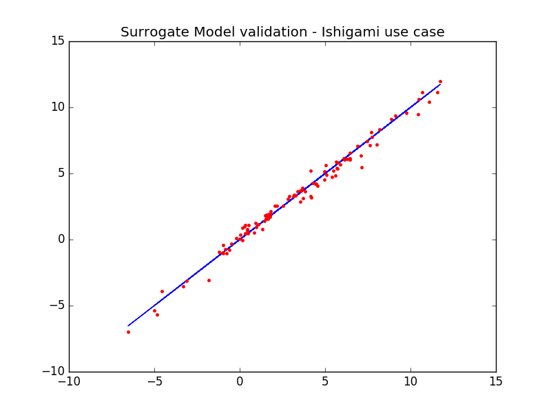

Examples
========

Latin Hypercube Sample
----------------------
Class :class:`~otlhs.LHSDesign` builds designs of a fixed size, type and bounds.
Comparing to the :class:`~openturns.LHSExperiment` of OpenTURNS library, when regenerating sample, the cells selection changes.

.. doctest::

    >>> import openturns as ot
    >>> import otlhs
    >>> ot.RandomGenerator.SetSeed(0)
    >>> #  Generating a design of size N=100
    >>> N = 100
    >>> # Considering independent Uniform distributions of dimension 3
    >>> # Bounds are (-1,1), (0,2) and (0, 0.5)
    >>> bounds = ot.Interval([-1,0,0], [1,2,0.5])
    >>> # Random LHS
    >>> lhs_random = otlhs.LHSDesign(bounds, N)
    >>> randomLHS = lhs_random.generate()
    >>> # Centered LHS
    >>> lhs_centered = otlhs.LHSDesign(bounds, N, True)
    >>> centeredLHS = lhs_centered.generate()
    >>> print(centeredLHS[0])
    [-0.65,1.47,0.2325]

Plot of LHS
-----------
Class :class:`~otlhs.pyplotdesign.PyPlotDesign` helps to plot a LHS design and draw it through matplotlib.\\

.. doctest::

    >>> import openturns as ot
    >>> import otlhs
    >>> from otlhs.pyplotdesign import PyPlotDesign
    >>> import matplotlib.pylab as plt
    >>> #  Generating a design of size N=10
    >>> N = 10
    >>> # Considering independent Uniform distributions of dimension 3
    >>> # Bounds are (-1,1), (0,2) and (0, 0.5)
    >>> bounds = ot.Interval([-1,0,0], [1,2,0.5])
    >>> # Centered LHS
    >>> lhs_centered = otlhs.LHSDesign(bounds, N, True)
    >>> centeredLHS = lhs_centered.generate()
    >>> # Draw design and grid
    >>> plot = PyPlotDesign(centeredLHS, bounds, 10, 10)
    >>> # Show the graph
    >>> plt.show()
    >>> # Export the graph
    >>> plot.savefig('design.png')

LHS and space filling
---------------------
:class:`~otlhs.SpaceFilling` is an abstract class to compute the criterion value of a given design. :class:`~otlhs.SpaceFillingC2` and :class:`~otlhs.SpaceFillingPhiP` are implemented here.
Note that these classes support only the computation of the criterion, and not its optimization.

.. doctest::

    >>> import openturns as ot
    >>> import otlhs
    >>> #  Generating a design of size N=100
    >>> N = 100
    >>> # Considering independent Uniform distributions of dimension 3
    >>> # Bounds are (-1,1), (0,2) and (0, 0.5)
    >>> bounds = ot.Interval([-1.0, 0.0, 0.0], [1.0, 2.0, 0.5])
    >>> # Random LHS
    >>> lhs = otlhs.LHSDesign(bounds, N)
    >>> design = lhs.generate()
    >>> # C2
    >>> c2 = otlhs.SpaceFillingC2().evaluate(design)
    >>> # PhiP with default p
    >>> phip = otlhs.SpaceFillingPhiP().evaluate(design)
    >>> # mindist
    >>> mindist = otlhs.SpaceFillingMinDist().evaluate(design)
    >>> # For p->infinity
    >>> phip_inf = otlhs.SpaceFillingPhiP(100).evaluate(design)

Optimized LHS using Monte Carlo
-------------------------------
As with Monte Carlo, user decides of a fixed number of iterations, but this time this number is part of the temperature profile.
Two profiles are currently provided:
- Linear profile: :math:`T(i) = T(0) \left( 1 - \frac{i}{nrIter} \right)`
- Geometric profile: :math:`T(i) = T(0) c^i,\; 0 < c < 1`

Starting from an LHS design, a new design is built by permuting a random coordinate of two randomly chosen sample points; this new design is also an LHS. but not necessary a `more efficient` design.
A comparison of criteria of the two designs is done, and the new LHS is accepted with probability

.. math::

    min\left(exp\left[ -\frac{ \phi(\text{LHSnew}) - \phi(\text{LHS})}{T(i)} \right], 1\right)

.. doctest::

    >>> import openturns as ot
    >>> import otlhs
    >>> designSize = 100
    >>> # Considering independent Uniform(0,1) distributions of dimension 3
    >>> bounds = ot.Interval(3)
    >>> # Random LHS
    >>> lhs = otlhs.LHSDesign(bounds, N)
    >>> algo = otlhs.SimulatedAnnealingLHS(lhs)
    >>> result = algo.generate()
    >>> # Retrieve optimal design
    >>> design = result.getOptimalDesign()

One could also fix the criterion, the temperature profile and gets more results.

.. doctest::

    >>> import openturns as ot
    >>> import otlhs
    >>> #  Generating a design of size N=100
    >>> N = 100
    >>> # Considering independent Uniform distributions of dimension 3
    >>> # Bounds are (-1,1), (0,2) and (0, 0.5)
    >>> bounds = ot.Interval([-1,0,0], [1,2,0.5])
    >>> # Random LHS
    >>> lhs = otlhs.LHSDesign(bounds, N)
    >>> # Fixing C2 crit
    >>> space_filling = otlhs.SpaceFillingC2()
    >>> # Defining a temperature profile
    >>> # A geometric profile seems accurate with default parameters
    >>> # e.g. T0=10, c=0.95, iMax=2000
    >>> temperatureProfile = otlhs.GeometricProfile()
    >>> algo = otlhs.SimulatedAnnealingLHS(lhs, temperatureProfile, space_filling)
    >>> result = algo.generate()
    >>> # Retrieve optimal design
    >>> design = result.getOptimalDesign()
    >>> # Criteria for the optimal design
    >>> crit_c2 = result.getC2()
    >>> crit_phip = result.getPhiP()
    >>> crit_mindist = result.getMinDist()
    >>> # History of the criterion used for optimization
    >>> history = result.getAlgoHistory()
    >>> criterion_hist = history[:, 0]
    >>> # Additional results
    >>> temperature_hist = history[:, 1]
    >>> probability_hist = history[:, 2]

It is also possible to chain several iterations of the whole process with different starting points.

.. doctest::

    >>> import openturns as ot
    >>> import otlhs
    >>> #  Generating a design of size N=100
    >>> N = 100
    >>> # Considering independent Uniform distributions of dimension 3
    >>> # Bounds are (-1,1), (0,2) and (0, 0.5)
    >>> bounds = ot.Interval([-1,0,0], [1,2,0.5])
    >>> # Random LHS
    >>> lhs = otlhs.LHSDesign(bounds, N)
    >>> # Fixing PhiP crit
    >>> space_filling = otlhs.SpaceFillingPhiP()
    >>> # Defining a temperature profile
    >>> # T0=10, iMax=3000
    >>> temperatureProfile = otlhs.LinearProfile(10.0, 3000)
    >>> algo = otlhs.SimulatedAnnealingLHS(lhs, temperatureProfile, space_filling)
    >>> restart = 50
    >>> result = algo.generate(restart)
    >>> # Retrieve optimal design
    >>> design = result.getOptimalDesign()
    >>> # Retrieve all optimal designs
    >>> designs = [result.getOptimalDesign(i) for i in range(restart)]

Finally, we could start the optimization process of LHS using a precomputed LHS design.

.. doctest::

    >>> import openturns as ot
    >>> from openturns.viewer import View
    >>> import otlhs
    >>> #  Generating a design of size N=100
    >>> N = 100
    >>> # Considering independent Uniform distributions of dimension 3
    >>> # Bounds are (0,1)^3
    >>> bounds = ot.Interval(3)
    >>> # Random LHS
    >>> lhs = otlhs.LHSDesign(bounds, N)
    >>> # Fixing C2 crit for example
    >>> space_filling = otlhs.SpaceFillingC2()
    >>> # Defining a temperature profile
    >>> # T0=10, iMax=3000
    >>> temperatureProfile = otlhs.LinearProfile(10.0, 3000)
    >>> algo = otlhs.SimulatedAnnealingLHS(lhs, temperatureProfile, space_filling)
    >>> result = algo.generate()
    >>> # optimal design
    >>> design = result.getOptimalDesign()
    >>> # check history ==> draw criterion
    >>> View(result.drawHistoryCriterion()).show()
    >>> # Convergence needs to be performed
    >>> # New algo starting from this design
    >>> algo = otlhs.SimulatedAnnealingLHS(design, bounds, temperatureProfile, space_filling)
    >>> result = algo.generate()
    >>> # New design
    >>> design = result.getOptimalDesign()

Ishigami test
-------------
The following example illustrates the generation of an optimal design for surrogate model learning purposes.
The use case proposed here is the Ishigami function. The model requires 3 input parameters, which are known to be
uniformly distributed in :math:`[-\pi,\pi]^3`.

.. literalinclude:: ../t_ishigami.py

We illustrate hereafter the design obtained that optimize the :math:`C_2` criterion.

The design seems accurate. To complete this example, the validation using an independent validation sample is done.

